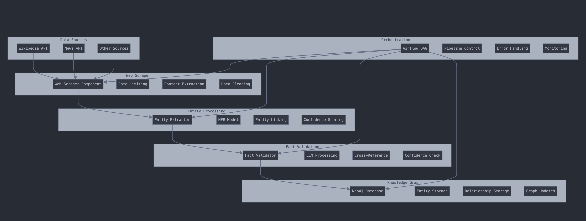

# Multi Source Knowledge Graph Builder with LLM

## Overview

This project implements a comprehensive system for building and maintaining a knowledge graph from various web sources. It includes components for web scraping, entity extraction, relationship identification, fact validation, and graph database management.

The system is designed to run as an automated pipeline using Apache Airflow, allowing for scheduled updates to the knowledge graph.

## System Architecture



The above diagram illustrates the overall architecture of the Knowledge Graph Builder system, showcasing the flow of data from various sources through different processing stages to the final knowledge graph storage.

Key components include:
- Data Sources: Wikipedia API, News API, and other sources
- Web Scraper: Handles rate limiting, content extraction, and data cleaning
- Entity Processing: Extracts entities, applies NER models, performs entity linking and confidence scoring
- Fact Validation: Validates facts using LLM processing, cross-referencing, and confidence checks
- Knowledge Graph: Stores entities and relationships in a Neo4j database
- Orchestration: Manages the pipeline using Airflow DAG, with error handling and monitoring

## Project Structure

```
.
├── src/
│   ├── scrapers/
│   │   ├── base_scraper.py
│   │   └── web_scraper.py
│   ├── extractors/
│   │   ├── entity_extractor.py
│   │   └── relationship_extractor.py
│   ├── validators/
│   │   └── fact_validator.py
│   ├── graph/
│   │   └── knowledge_graph.py
│   └── pipeline/
│       └── orchestrator.py
├── dags/
│   └── knowledge_graph_dag.py
├── config/
│   └── config.yaml
├── system_architecture.png
└── README.md
```

## Components

1. **Web Scraper**: Extracts raw data from specified web sources.
2. **Entity Extractor**: Identifies named entities in the scraped text.
3. **Relationship Extractor**: Determines relationships between extracted entities.
4. **Fact Validator**: Verifies extracted facts using a language model.
5. **Knowledge Graph**: Manages the Neo4j graph database for storing entities and relationships.
6. **Pipeline Orchestrator**: Coordinates the entire process from scraping to graph updates.
7. **Airflow DAG**: Defines the workflow for scheduled execution of the pipeline.

## Setup

1. Clone the repository:
   ```
   git clone https://github.com/your-username/knowledge-graph-builder.git
   cd knowledge-graph-builder
   ```

2. Install dependencies:
   ```
   pip install -r requirements.txt
   ```

3. Set up Neo4j:
   - Install Neo4j (https://neo4j.com/download/)
   - Start a Neo4j instance
   - Note down the URI, username, and password

4. Configure the system:
   - Copy `config/config.example.yaml` to `config/config.yaml`
   - Update the Neo4j connection details and other settings in `config.yaml`

5. Set up Apache Airflow:
   - Install Airflow: `pip install apache-airflow`
   - Initialize the Airflow database: `airflow db init`
   - Start the Airflow webserver: `airflow webserver --port 8080`
   - Start the Airflow scheduler: `airflow scheduler`

6. Add the DAG to Airflow:
   - Copy `dags/knowledge_graph_dag.py` to your Airflow DAGs folder

## Usage

1. Ensure Neo4j and Airflow are running.

2. Access the Airflow web interface (default: http://localhost:8080).

3. Enable the `knowledge_graph_builder` DAG.

4. The DAG will run automatically based on the schedule interval (default: daily).

5. To run the DAG manually:
   - In the Airflow UI, find the `knowledge_graph_builder` DAG
   - Click on the "Trigger DAG" button

6. Monitor the DAG runs in the Airflow UI for any errors or issues.

7. Query the Neo4j database to explore the built knowledge graph.

## Customization

- To add new data sources, update the `sources` list in `config.yaml`.
- To modify the scraping logic, edit `src/scrapers/web_scraper.py`.
- To change entity extraction or relationship identification, update the respective files in `src/extractors/`.
- To adjust fact validation, modify `src/validators/fact_validator.py`.

## Contributing

Contributions are welcome! Please feel free to submit a Pull Request.

## License

This project is licensed under the MIT License.
